# RedHill - Railway Complaint Management System

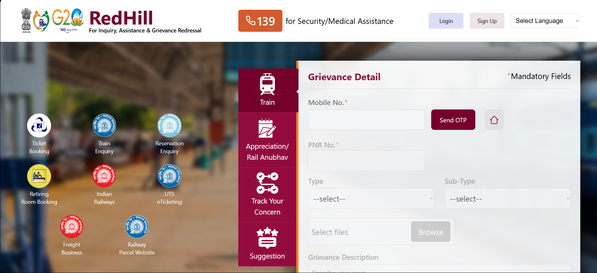

**RedHill** is an upgraded RailMadad developed for **Smart India Hackathon (SIH) 2024**. It provides a unified platform for passengers to lodge complaints, track their status, and for railway authorities to efficiently manage and resolve issues through an advanced admin panel powered by AI/ML technologies.

###  User Frontend

- **Modern Landing Page**: Intuitive interface for easy complaint submission
- **Multi-language Support**: Submit complaints in different languages

  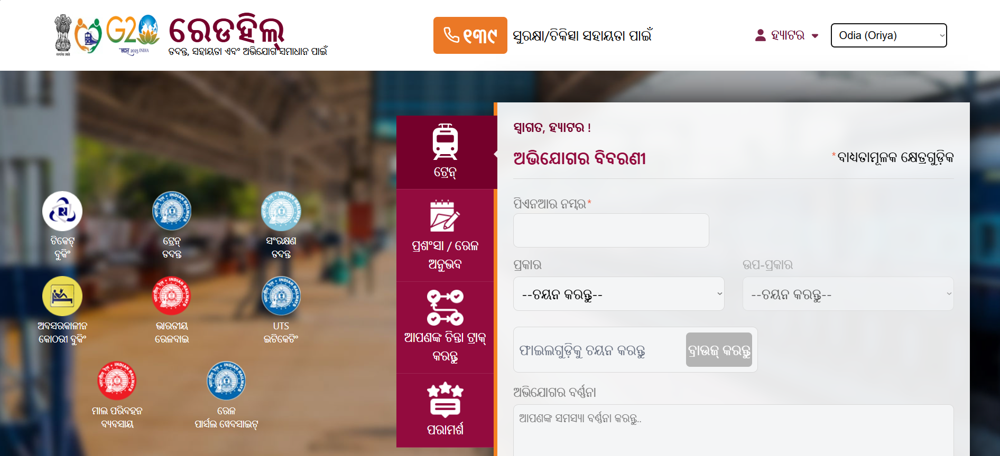

- **Complaint Management**: View, track, and manage submitted complaints

  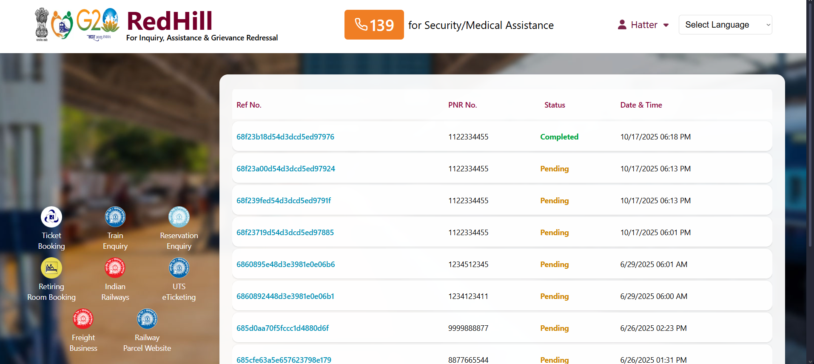

  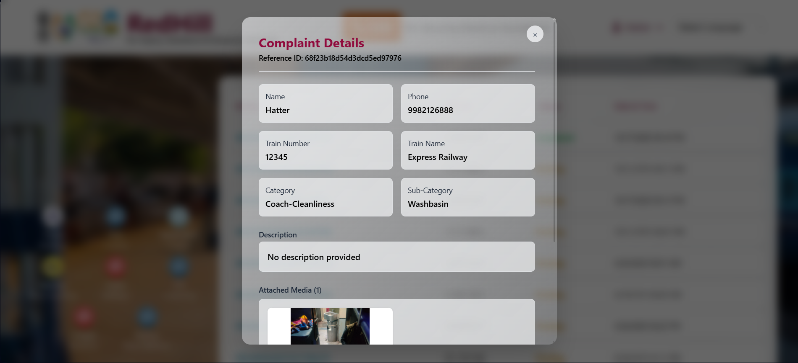

- **AI-Powered Chatbot**: Get instant assistance and guidance

  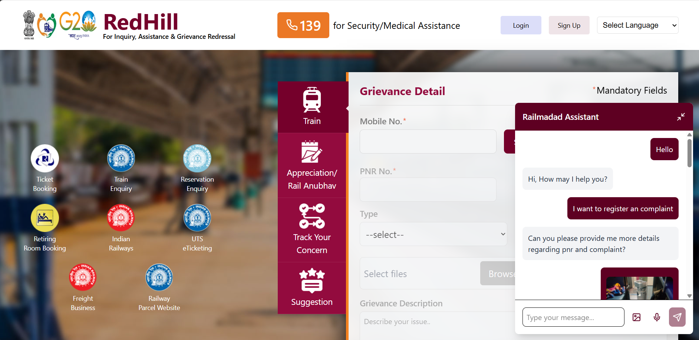

###  Admin Panel

Comprehensive admin dashboard with advanced analytics and management features:

- **Dashboard with Analytics**: Real-time statistics and insights

  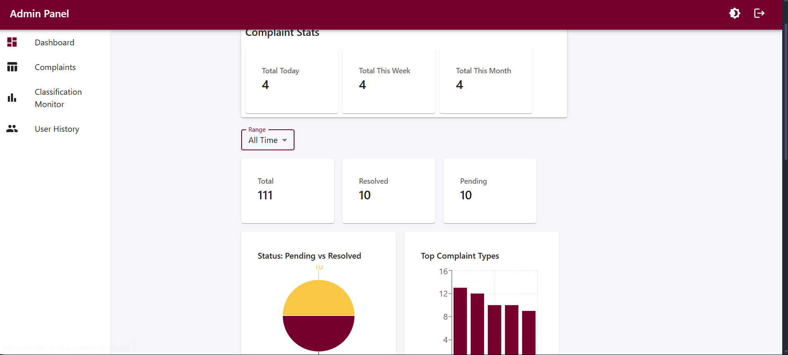

- **Heatmap Visualization**: Geographic distribution of complaints

  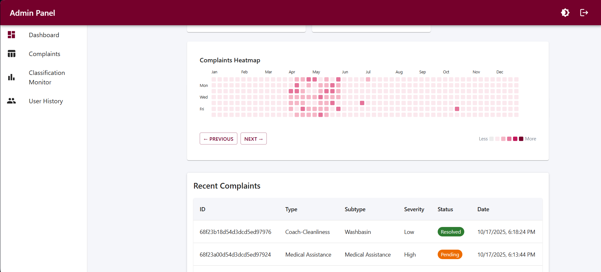

- **Complaint Classification Monitor**: AI-powered complaint categorization

  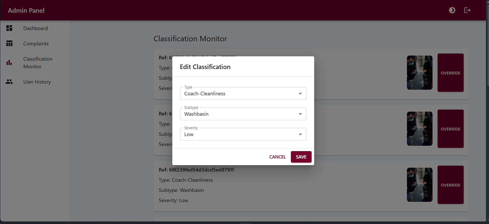

- **Advanced Filtering**: Filter complaints by various criteria

  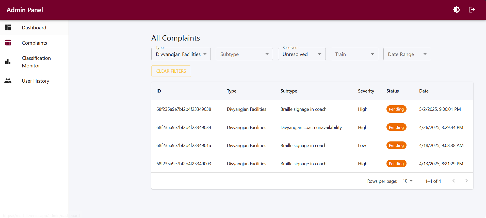


- **User History Tracking**: Comprehensive user activity monitoring

  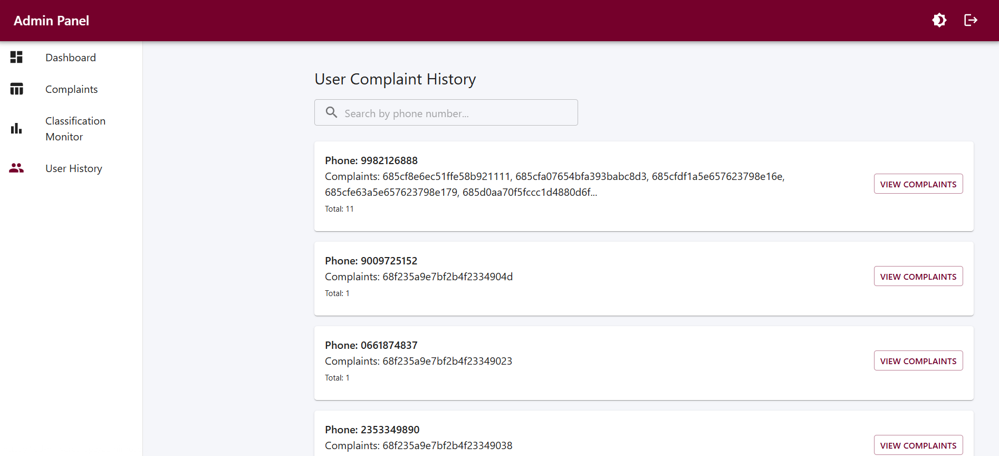

- **Dark Mode Support**: Enhanced UI experience

  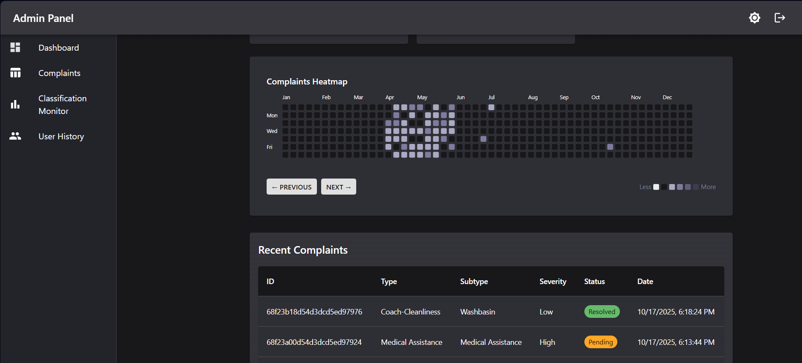


---

## Key Features

### For Passengers 
* **Dynamic Complaint Forms:** Intuitive forms for Trains and Stations with support for media uploads (Images/Videos).
* **Real-time Tracking:** Track complaint status using a Reference ID.
* **Multi-Language Support:** Integrated **Google Translate** widget allowing the interface to be accessed in regional Indian languages (Hindi, Bengali, Marathi, Tamil, etc.).
* **Cost-Effective OTP Service:** A unique implementation using **Telegram Bot Webhooks** (`backend/controllers/otpController.js`) to verify phone numbers and send OTPs, bypassing expensive SMS gateways.
* **AI Chat Assistant:** A floating chat widget that allows users to register complaints conversationally.

### For Administrators (Admin Panel)
* **Insightful Dashboard:** Statistics on total, resolved, and pending complaints with graphical visualizations.
* **Complaint Heatmap:** Uses `cal-heatmap` to visualize complaint frequency over time (daily/monthly), helping identify peak grievance periods.
* **Classification Monitor:** AI-classified complaints are reviewed here. Admins can override AI predictions if necessary.
* **User History:** View the complete complaint history of specific passengers based on phone numbers.
* **Theme Support:** Fully responsive Light/Dark mode toggle.

---

## Machine Learning Modules

The project utilizes a robust Python-based microservice architecture (FastAPI) to handle intelligent processing.

### 1. Multimodal Classifier (`multimodalClassifier.py`)
This module automatically categorizes complaints into official Railway categories (e.g., "Coach-Cleanliness", "Security") based on user input.
* **How it works:** It utilizes a **Hybrid Approach**. It processes text descriptions using **GPT-4** and analyzes uploaded images/videos using a **Vision Transformer (ViT)** model (`google/vit-base-patch16-224`) via a `SimilarityFinder`.
* **Logic:** It matches visual evidence against a database of known grievance scenarios and combines this with text intent to output a strict JSON classification including Category, Subcategory, and Severity (High/Medium/Low).

### 2. Intelligent Chatbot (`chatbot.py`)
A conversational agent that allows users to report issues naturally.
* **How it works:** Built on **FastAPI** and **OpenAI (GPT-4o-mini)**. It maintains conversation context to extract necessary details (Train No, PNR, Issue Description) from natural language.
* **Features:** It can intelligently decide when enough information has been gathered to register a formal complaint and calls the classification engine in the background.

### 3. Universal PNR Extractor (`pnr.py`)
To validate complaints, this module extracts the 10-digit PNR number from various media types provided by the user.
* **Text:** Regular Expression extraction.
* **Images:** Uses **Tesseract OCR** to read PNR numbers from photos of tickets.
* **Audio:** Uses **OpenAI Whisper** (local model) to transcribe voice notes and extract PNRs mentioned verbally.

---

## Tech Stack

### Frontend
* **Framework:** React.js (Vite)
* **Styling:** Tailwind CSS, Material UI (MUI)
* **State Management:** Redux Toolkit
* **Visualization:** Recharts, Cal-Heatmap

### Backend
* **Runtime:** Node.js
* **Framework:** Express.js
* **Database:** MongoDB Atlas (Mongoose)
* **Caching:** Redis (for session management & auth tokens)
* **Authentication:** JWT (JSON Web Tokens)

### ML Services
* **Language:** Python
* **API Framework:** FastAPI
* **Models:** GPT-4, ViT (Vision Transformer), Whisper, Tesseract OCR
* **Libraries:** PyTorch, OpenCV, LangChain, Transformers

---

## Project Structure

```
RedHill/
├── assets/                          # Project screenshots and documentation assets
├── backend/                         # Node.js/Express backend
│   ├── Admin/                       # Admin-specific routes and controllers
│   │   ├── controllers/            # Admin business logic
│   │   └── routes/                 # Admin API routes
│   ├── config/                     # Database and Redis configuration
│   ├── controllers/                # Main application controllers
│   ├── middleware/                 # Authentication and validation middleware
│   ├── models/                     # MongoDB data models
│   ├── routes/                     # API routes
│   ├── services/                   # External service integrations
│   └── utils/                      # Utility functions and helpers
├── frontend/                       # React frontend application
│   ├── public/                     # Static assets
│   ├── src/
│   │   ├── admin/                  # Admin panel components and pages
│   │   │   ├── components/         # Reusable admin components
│   │   │   ├── pages/              # Admin page components
│   │   │   └── utils/              # Admin utilities
│   │   ├── components/             # Shared UI components
│   │   ├── pages/                  # Main application pages
│   │   ├── reducers/               # Redux state management
│   │   └── utils/                  # Frontend utilities and contexts
├── ml servers/                     # AI/ML microservices
│   ├── chatbot.py                  # Intelligent chatbot service
│   ├── multimodalClassifier.py     # Text/Image classification service
│   ├── pnr.py                      # PNR data extraction service
│   └── similarityFinder.py         # Content similarity matching
└── test/                           # Testing utilities and data
```

## Getting Started

### Prerequisites

- **Node.js** (v16 or higher)
- **MongoDB** (local or cloud instance)
- **Redis** server
- **Python** (3.8+) for ML services
- **OpenAI API Key** for AI features

### Installation

1. **Clone the repository**

   ```bash
   git clone https://github.com/HatterByte/RedHill.git
   cd RedHill
   ```

2. **Install dependencies**

   ```bash
   # Install root dependencies
   npm install

   # Install backend dependencies
   cd backend
   npm install
   cd ..

   # Install frontend dependencies
   cd frontend
   npm install
   cd ..
   ```

3. **Set up environment variables**

   Create `.env` file in the backend directory:

   ```env
   NODE_ENV=development
   PORT=5000
   MONGODB_URI=mongodb://localhost:27017/redhill
   REDIS_URL=redis://localhost:6379
   JWT_SECRET=your_jwt_secret_here
   OPENAI_API_KEY=your_openai_api_key
   FRONTEND_URL=http://localhost:5173
   ```

4. **Start the services**

   **Development Mode (All services):**

   ```bash
   npm run dev
   ```

   **Individual Services:**

   ```bash
   # Frontend only
   npm run start:frontend

   # Backend only
   npm run start:backend

   # ML Services (in separate terminals)
   cd "ml servers"
   python chatbotServer.py
   python classifierServer.py
   ```

5. **Access the application**
   - **Frontend**: http://localhost:5173
   - **Backend API**: http://localhost:5000
   - **Admin Panel**: http://localhost:5173/admin

## 🔧 Configuration

### Database Setup

- Ensure MongoDB is running on your system
- Create a database named `redhill`
- The application will automatically create necessary collections

### Redis Setup

- Install and start Redis server
- Default configuration connects to `localhost:6379`

### ML Services Configuration

- Install Python dependencies:
  ```bash
  pip install fastapi uvicorn openai pillow pytesseract torch transformers
  ```
- Configure OpenAI API key in environment variables
- Ensure Tesseract OCR is installed for image text extraction

---

**Built with ❤️ for Smart India Hackathon 2024**
